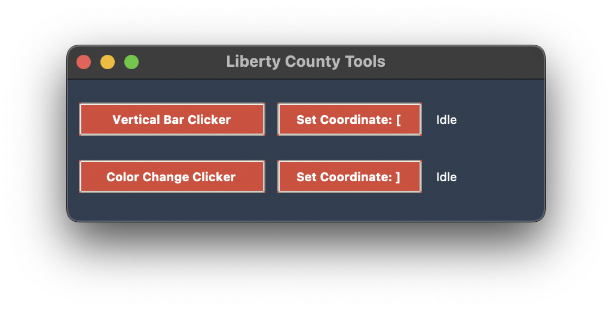

# Liberty County Tools GUI

A set of automation tools for **Emergency Response: Liberty County** on Roblox.

## Features

- **Color Change Clicker for ATM**: Automatically clicks the correct box in the RFID ATM minigame when the color changes.
- **Vertical Bar Clicker for House Lockpicking**: Clicks when the vertical bar aligns with the correct position.
- **Safe Cracker (Coming Soon)**: Currently being tested and not included in this release.

---

## Installation (macOS)

1. **Download & Open the `.dmg`**
   - Go to the **Releases** tab in GitHub and download `Liberty County Tools GUI.dmg`.
   - Double-click `Liberty County Tools GUI.dmg`.
2. **Install the Application**
   - Drag `Liberty County Tools.app` into the `Applications` folder.
3. **Grant Required Permissions** (Hotkeys & Mouse Automation)
   - Go to **System Settings** > **Privacy & Security**
   - Under **Accessibility**, **Screen & System Audio Recording**, and **Input Monitoring**, add `Liberty County Tools` (go to all 3 menus).
   - If you don’t see the app in the list, press `+` locate where you installed it (in applications folder).

**Note**: The app may take ~10 seconds to open.

---

## How to Use

### **Color Change Clicker for ATM**

1. Open the RFID ATM minigame.
2. Click the **Color Change Clicker** button in the app.
3. Place your mouse cursor over the target sequence's box.
4. Press the hotkey **`]`** (right bracket) to set the coordinate and start monitoring.
5. The tool will detect color changes at that set coordinate and automatically click when the color changes.

### **Vertical Bar Clicker for House Lockpicking**

1. Open the lockpicking minigame.
2. Click the **Vertical Bar Clicker** button in the app.
3. Place your mouse near the center bar.
4. Press the hotkey **`[`** (left bracket) to set the coordinate and start monitoring.
5. The tool will track pixels above and below that set coordinate and click when both match the bar’s color.

---
